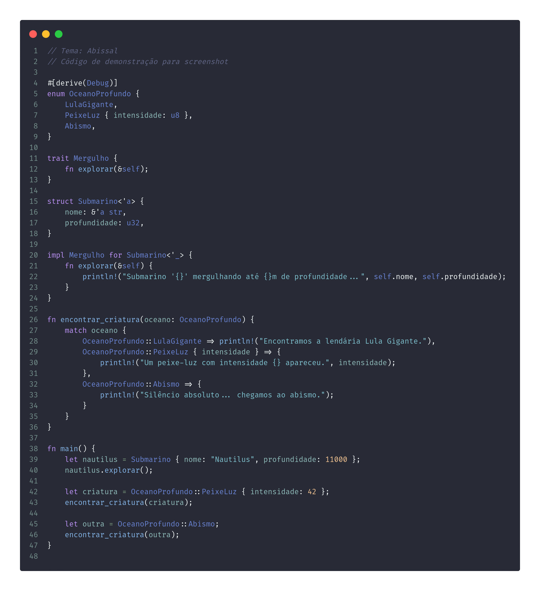

# Abissal Theme

**Abissal** is a sleek, high-contrast dark theme for Visual Studio Code. It was designed to offer a deep, immersive coding environment with vibrant syntax highlighting and a balanced color palette that reduces eye strain.



## Features

- Deep dark background with high contrast for readability
- Subtle UI elements that reduce distractions
- Vivid syntax highlighting for popular languages
- Carefully selected colors that enhance focus during long coding sessions

## Installation

1. Go to the **Extensions** view in Visual Studio Code.
2. Search for `Abissal Theme`.
3. Click **Install**.
4. Open the Command Palette (`Ctrl+Shift+P` or `Cmd+Shift+P` on macOS), then select `Preferences: Color Theme` and choose **Abissal**.

## Recommended Settings

To get the best experience with Abissal, you may want to use:

```json
"editor.fontFamily": "Fira Code, JetBrains Mono, monospace",
"editor.fontLigatures": true
